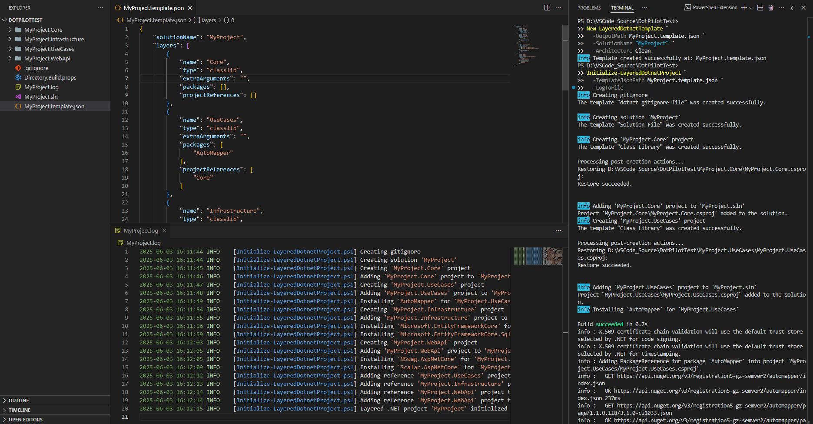

# DotPilot

DotPilot is a toolset that automates project setup and resource management.

## Requirements

* **PowerShell:** Version 7.4 or higher is recommended
* **Dotnet:** Core 9.0 is recommended (other versions have not been tested).

## Quick start

You can find detailed documentation [here](Docs).

### Install from the PowerShell Gallery (recommended)

Not available

### Install from the GitHub repository

If you want to try out the latest features:

1. Clone this repository
2. Open the PowerShell 7 terminal and run the following script:
```powershell
.\Setup.ps1
```
3. You're all set! Read the documentation and dive in—yayyyyyyyyyy ○( ＾皿＾)っ Hehehe...

### Example

#### Create .NET Project

- Step 1: Create a Clean Architecture template with the solution name `MyProject`.

```powershell
New-LayeredDotnetTemplate `
    -OutputPath MyProject.template.json `
    -SolutionName "MyProject" `
    -Architecture Clean
```

- Step 2: Initialize the project using the created template.

```powershell
Initialize-LayeredDotnetProject `
    -TemplateJsonPath MyProject.template.json `
    -LogToFile
```

<details>
    <summary>Output</summary>



</details>

## Shout out

* Documentation is automatically generated using [platyPS](https://github.com/PowerShell/platyPS).
* Automatic testing by [Pester](https://github.com/pester/Pester)

## CHANGELOG

See [CHANGELOG.md](CHANGELOG.md)
